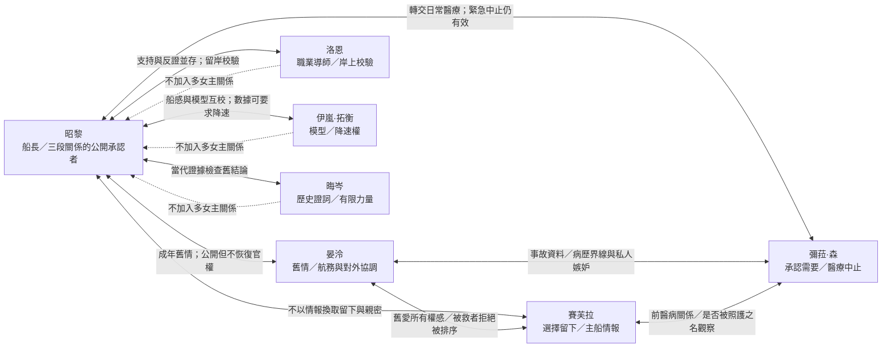

# 第一大章人物關係圖 v0.2

## 關係總圖

## 關係判讀

| 關係 | 起點 | 主要衝突 | 章末狀態 |
| --- | --- | --- | --- |
| 昭黎 ↔ 晏泠 | 成年舊情人與事故審查對象 | 她以公務靠近，他不願讓舊情成為否認責任的理由 | 案件迴避後重建關係；她以試航團航務身分同行，無案件或航照單獨決定權 |
| 昭黎 ↔ 賽芙拉 | 救援者與保留沉默的倖存者 | 她害怕失去情報便失去價值，隱瞞訊號造成實害 | 她在可離開時選擇留下，以本人姓名、獨立艙室與離船權加入 |
| 昭黎 ↔ 彌菈 | 事故當事人與檢疫醫官 | 她壓抑偏袒，他習慣只接受照護而不看她的需要 | 轉交日常醫療後承認關係；她保有全船緊急醫療中止權 |
| 晏泠 ↔ 賽芙拉 | 舊愛與新近依附者互相審視 | 晏泠質疑賽芙拉利用被救身分；賽芙拉拒絕被主動放棄昭黎的人排序 | 承認對方關係確實存在，嫉妒與互不信任仍保留 |
| 晏泠 ↔ 彌菈 | 事故資料需求與病歷保護 | 專業界線混入對昭黎的比較與嫉妒 | 同意資料與病歷依權限分流，不要求彌菈替三人維持和平 |
| 賽芙拉 ↔ 彌菈 | 病患與醫官 | 賽芙拉懷疑彌菈曾以照護之名觀察；彌菈因舊醫病權力較晚承認私情 | 醫療依賴解除後承認彼此同在多伴侶關係中，不發展彼此性愛 |
| 昭黎 ↔ 洛恩 | 受訓者與直屬前輩 | 昭黎把承擔當授權；洛恩用工作代替關心 | 洛恩留岸保存獨立航誌，兩人成為可互相問責的同業 |
| 昭黎 ↔ 伊嵐·拓衡 | 現場船感與觀測模型 | 快速可行與完整數據的時間衝突 | 船況與模型互校；伊嵐保有數據超標降速權 |
| 昭黎 ↔ 晦岑 | 當代行動者與歷史見證者 | 舊災難能否永久決定新制度 | 昭黎繼承代價而不繼承不可質疑的答案；晦岑不替他決定航線 |

## 私人關係與職務權限註記

**私人關係不得覆蓋職務權限。**此規則對所有人雙向成立：伴侶不得因親密取得命令優先權，也不得因嫉妒阻擋另一專業席依法履職。

- 昭黎不得以船長權限、艙位、留船資格或航線資源換取親密；三名伴侶均保有退出關係及離船權。
- 晏泠在第十四幕交還昭黎案件權限；章末不得單獨審批其航照、事故責任或靠港豁免。
- 彌菈在第二十二幕轉交昭黎日常醫療，但緊急醫療與全船安全中止權不因伴侶身分削弱。
- 賽芙拉保有主船情報控制，卻須為影響共同航行安全的隱瞞接受追責；伴侶身分不構成情報豁免。
- 洛恩的岸上校驗、伊嵐的降速權、晦岑的歷史異議均不能被昭黎以私人信任取代。
- 三名女主不彼此發生性關係；章末只停止以否認、秘密與職權排除對方，並未消除嫉妒或形成親密姊妹關係。
